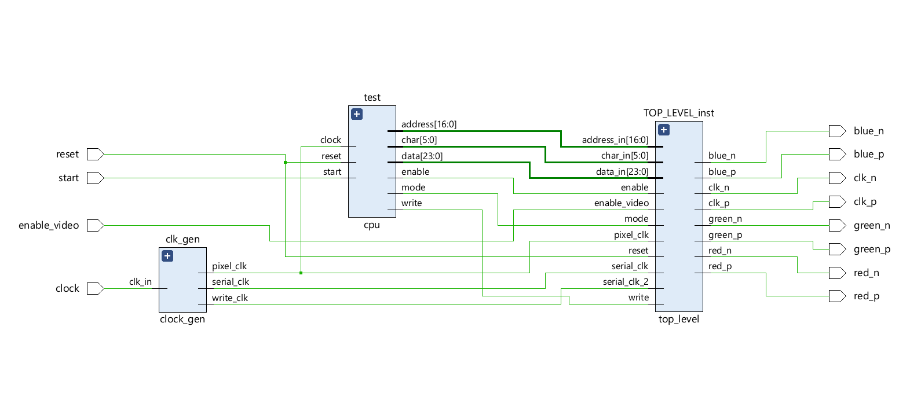
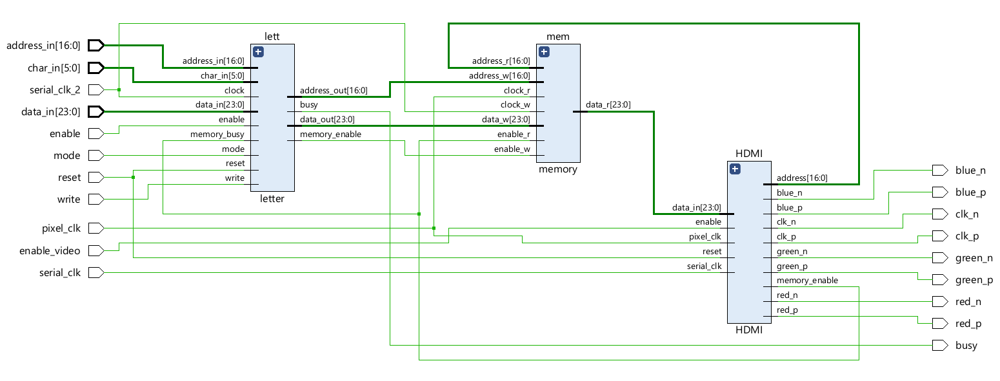
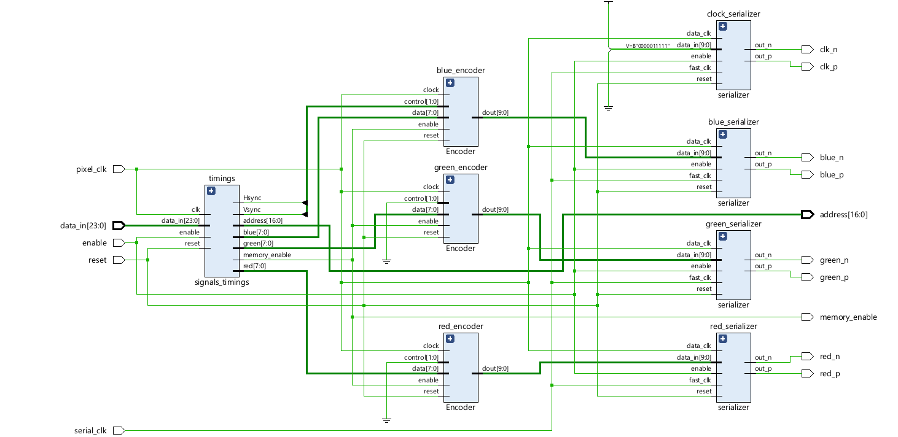

# HDMI_output_on_VHDL
VHDL code for HDMI output on a Zybo z7-20.
The HDMI module reads each pixels from a memory that stores the data of each frame; the memory can be written by the cpu of the Zynq chip but I'm currently working on it.
In this project the actual cpu is replaced by a vhdl module that simulates some writings.

# story
It was an university project on VHDL that is part of something bigger that should also connect to the ARM cpu of the Zynq chip. I tried doing everything myself without using IPs in order to learn VHDL.

# specs
current resolution is 480x640 60 Hz

# references
Understanding the encoder module: https://www.cs.unc.edu/Research/stc/FAQs/Video/dvi_spec-V1_0.pdf

# Explanation

### toppest_lvl
toppest_lvl.vhd is the higher wrapper module of everything, it contains cpu, clock_gen and top_lvl:

The cpu simulates a device that writes into a memory (inside top_lvl) that stores the bit values of the pixels of the current frame to display. Each pixel is 24 bits and the cpu can write 1 pixel at time at the specified address.
The clock_gen module generates the necessary clocks.

### top_lvl
Top_lvl contains letter, memory and HDMI:

The letter module is between the cpu and the memory, it operates in two different ways depending on the value of the "mode" signal:

  -if mode = 1 then it draws a letter or a symbol indicated by the "char_in" vector such as the letter 'A' or the simbol '+'. Each symbol is contained in a rectangle of 5x6 pixels so it takes 30 writes to finish     drawing the symbol. The address received refers to the top-left corner of the rectangle

  -if mode = 0 then it just writes the value it receives from the cpu into the memory at the specified address. 

The memory module is a read/write memory that should contain 480x640 cells of 24 bits each but there aren't as many memory cells in the Zybo chip so it instead contains 240x320 cells of 24 bits each. It means that the resolution is still 480x640 but each pixel is 4 times bigger than it should so to the human eye the resolution is 240x320.

### HDMI
The HDMI module contains 1 signal_timings, 3 encoder_xor_xnor (one for each color: red, green and blue) and 4 serializer (one for each color and one for the output clock to have the same delay):

The signal_timings module generates the vertical and horizontal syncronization signals, according to the 480x640 60 Hz standard, and also reads from the memory the values of each pixel. This means that it generates an address to send to the memory, this address is coherent consistent to the 240x320 resolution of the memory (every pixel is repeated twice and every line is repeated twice).

The encoder module encodes every 8 bit color to the corresponding 10 bit vector following the document mentioned above. There is one encoder for each color.

The serializer sends each bit of the 10 bit vector one at the time.
